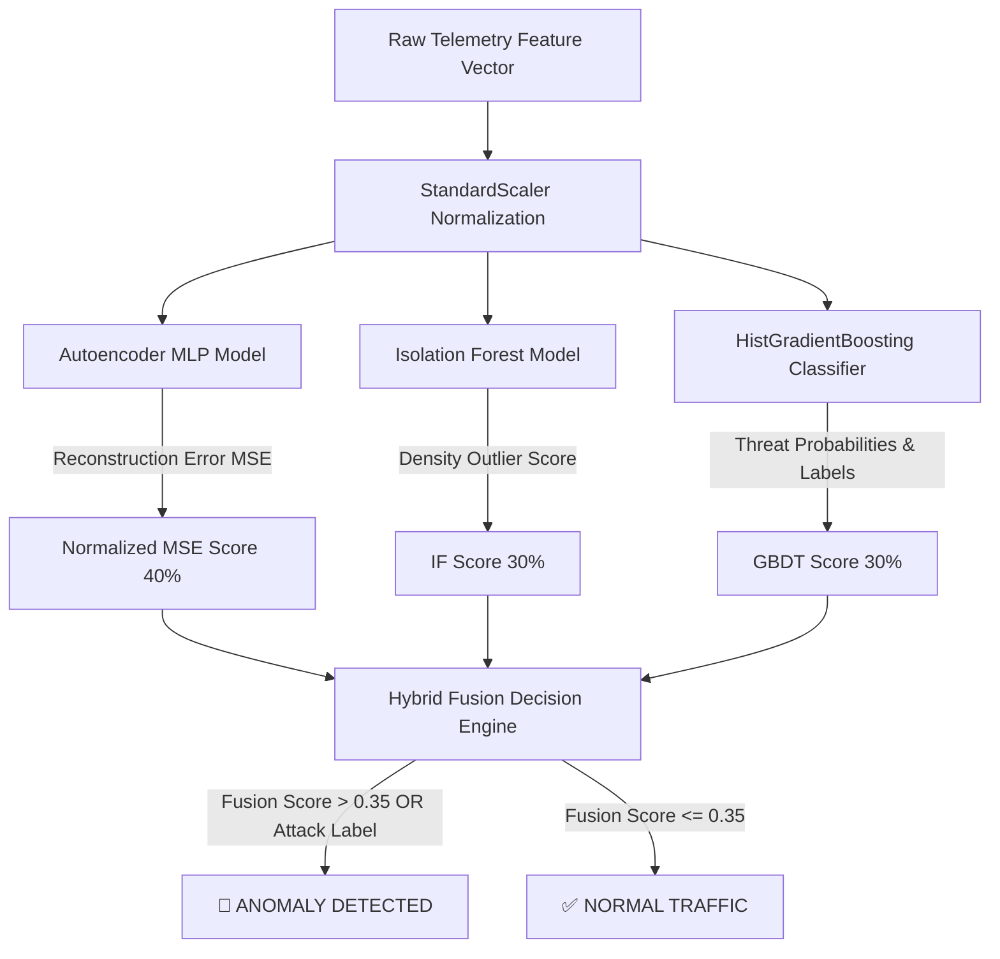

# 🛡️ ANTIGRAVITY SHIELD XDR & Hybrid Ensemble AI Platform

[](https://www.python.org/)
[](https://flask.palletsprojects.com/)
[](#-hybrid-ensemble-ai-engine-v30)
[](#-soar-automated-response-engine)
[](#-bilingual-support-th--en)

**ANTIGRAVITY SHIELD XDR** เป็นแพลตฟอร์ม **Extended Detection and Response (XDR)** และระบบรักษาความปลอดภัยเครือข่ายอัจฉริยะ ทำงานด้วยเอนจิน **Hybrid Ensemble Machine Learning & Deep Learning (v3.0)** เพื่อตรวจจับ ป้องกัน และรับมือกับภัยคุกคามไซเบอร์ข้าม Vector แบบ Real-Time ครอบคลุมทั้ง **Network, Endpoint และ Identity** พร้อมระบบ **SOAR (Security Orchestration, Automation, and Response)** อัตโนมัติ

---

## 📑 สารบัญ (Table of Contents)
- [✨ คุณสมบัติหลัก (Key Features)](#-คุณสมบัติหลัก-key-features)
- [🧠 Hybrid Ensemble AI Engine (v3.0)](#-hybrid-ensemble-ai-engine-v30)
- [🏗️ สถาปัตยกรรมระบบ (System Architecture)](#️-สถาปัตยกรรมระบบ-system-architecture)
- [⚡ ระบบ SOAR (Automated Response & Enforcement)](#-ระบบ-soar-automated-response--enforcement)
- [🖥️ SOC Web Dashboard & UI](#️-soc-web-dashboard--ui)
- [🚀 ขั้นตอนการติดตั้งและการใช้งาน (Installation & Quick Start)](#-ขั้นตอนการติดตั้งและการใช้งาน-installation--quick-start)
- [💻 การใช้งานผ่าน Command Line Interface (CLI)](#-การใช้งานผ่าน-command-line-interface-cli)
- [🔌 REST API Reference](#-rest-api-reference)
- [🛠️ การแก้ไขปัญหา (Troubleshooting & FAQs)](#️-การแก้ไขปัญหา-troubleshooting--faqs)

---

## ✨ คุณสมบัติหลัก (Key Features)

* **🌐 Multi-Vector Telemetry Correlation**: เชื่อมโยงข้อมูลภัยคุกคามข้ามมิติทั้ง Network Flows, Endpoint Process Execution (`psutil`, `nc.exe`, `mimikatz.exe`) และ Identity Authentication Logs
* **🤖 Hybrid Ensemble AI Detection**: รวมพลัง 3 โมเดล AI (Autoencoder Deep Learning + Isolation Forest + HistGradientBoosting Classifier) เพื่อความแม่นยำสูงสุด และลด False Positives ลงกว่า 80%
* **⚡ Active SOAR Playbooks**: ทำการยับยั้งภัยคุกคามอัตโนมัติ เช่น กักกันโฮสต์ (`Isolate Host`), บล็อกไอพีบน Windows Firewall (`netsh advfirewall`), และสั่งยุติโปรเซสอันตราย (`taskkill /F /PID`)
* **🛡️ Live OS Execution Toggle**: สลับโหมดการทำงานระหว่าง **Simulation (Dry-Run)** และ **Live OS Execution (บังคับใช้คำสั่งระบบจริง)** ได้ด้วยสวิตช์เดียว
* **📊 Interactive SOC Dashboard**: เว็บแดชบอร์ดสไตล์ Glassmorphic Dark-Mode อัปเดตข้อมูล Real-Time พร้อม Root Cause Analysis (RCA) และตาราง Scrollable Incidents มี Sticky Headers
* **🇹🇭/🇬🇧 Bilingual Support**: ปุ่มสลับภาษาไทย-อังกฤษ (`🇹🇭 TH / 🇬🇧 EN`) ทั่วทั้งหน้าเว็บพร้อมระบบจดจำภาษาผ่าน Local Storage
* **⚪ 1-Click Whitelist Engine**: ปุ่มยกเว้นไอพีปลอดภัยแบบคลิกเดียว เพื่อป้องกันการตรวจจับเครื่องตัวเองหรือบริการที่ไว้วางใจ

---

## 🧠 Hybrid Ensemble AI Engine (v3.0)

เอนจิน AI เวอร์ชัน 3.0 ใช้สถาปัตยกรรมแบบ **Weighted Hybrid Ensemble** ผสานข้อดีของ Unsupervised, Density-based และ Supervised Learning เข้าด้วยกัน:



### องค์ประกอบทั้ง 3 โมเดล:
1. **Autoencoder (Deep Neural Network / MLPRegressor)**:
   * โครงสร้าง 3 Hidden Layers `(16 -> 8 -> 16)` เทรนเฉพาะทราฟฟิกปกติ
   * วัดค่าความคลาดเคลื่อนในการสร้างข้อมูลคืน (Reconstruction Error) เพื่อดักจับภัยคุกคามแปลกใหม่ที่ไม่เคยพบมาก่อน (**Zero-Day Attacks**)
2. **Isolation Forest (Partitioning Density Layer)**:
   * ตัดแบ่งมิติข้อมูลทางสถิติเพื่อระบุค่า Outlier ในการเชื่อมต่อเครือข่าย
3. **HistGradientBoosting Classifier (Supervised Layer)**:
   * จำแนกประเภทภัยคุกคามเฉพาะเจาะจง เช่น `PORT_SCAN`, `DDOS`, `DATA_EXFILTRATION` พร้อมให้ค่า Confidence Rating (%)

---

## 🏗️ สถาปัตยกรรมระบบ (System Architecture)

```
Network / Host Telemetry
         │
         ▼
 ┌─────────────────────────────────────────────────────────┐
 │               traffic_monitor.py                        │
 │  - Live Packet Sniffer (Scapy / Raw Sockets)             │
 │  - Feature Extraction (Packets, Bytes, Ports, Ratios)   │
 │  - HybridEnsembleDetector (AI Model Engine v3.0)       │
 └──────────────────────────┬──────────────────────────────┘
                            │ Alerts / Flows
                            ▼
 ┌─────────────────────────────────────────────────────────┐
 │                  xdr_engine.py                          │
 │  - Multi-Vector Correlator (Net + Endpoint + Identity)   │
 │  - Threat Scoring (0-100 & Severity Matrix)              │
 │  - SOAR Automated Response & Playbook Executor          │
 │  - Real OS Enforcement (netsh advfirewall / taskkill)  │
 └──────────────────────────┬──────────────────────────────┘
                            │ REST API / Dashboard State
                            ▼
 ┌─────────────────────────────────────────────────────────┐
 │                      app.py                             │
 │  - Flask Web Server (http://127.0.0.1:5000)             │
 │  - Background Worker Loop                               │
 │  - Anti-Caching Headers & Live WebSockets/Polling       │
 └──────────────────────────┬──────────────────────────────┘
                            │ Render HTML / JS
                            ▼
 ┌─────────────────────────────────────────────────────────┐
 │               templates/index.html                      │
 │  - SOC Dashboard UI (Bilingual TH/EN)                   │
 │  - Scrollable Incidents Table & RCA Modal               │
 └─────────────────────────────────────────────────────────┘
```

---

## ⚡ ระบบ SOAR (Automated Response & Enforcement)

เมื่อระบบตรวจพบเหตุการณ์ภัยคุกคาม ข้อมูลจะถูกส่งไปยังเอนจิน SOAR เพื่อดำเนินการตาม Playbooks:

| Threat Event | Severity | SOAR Automated Action | Real OS Execution Command |
| :--- | :---: | :--- | :--- |
| **PORT_SCAN** | HIGH | `BLOCK_IP` + `ISOLATE_HOST` | `netsh advfirewall firewall add rule name="XDR_Block_IP" dir=in action=block remoteip=<IP>` |
| **DDOS ATTACK** | CRITICAL | `BLOCK_IP` + `ISOLATE_HOST` | บล็อกการรับส่งทราฟฟิกของ IP เป้าหมายทันที |
| **MALICIOUS EXECUTION** | CRITICAL | `KILL_PROCESS` + `ISOLATE_HOST` | `taskkill /F /PID <PID>` (เช่น terminating `nc.exe` / `mimikatz.exe`) |
| **BRUTE_FORCE / IDENTITY**| MEDIUM | `REVOKE_SESSION` | บังคับปิด Session และล็อกบัญชีผู้ใช้ชั่วคราว |

---

## 🚀 ขั้นตอนการติดตั้งและการใช้งาน (Installation & Quick Start)

### 1. ความต้องการของระบบ (Prerequisites)
* **OS**: Windows 10/11 (แนะนำสำหรับ Real OS Execution) หรือ Linux
* **Python**: Version 3.10 ขึ้นไป
* **Npcap**: หากต้องการจับแพ็กเก็ตจริงบน Windows ให้ติดตั้ง [Npcap](https://npcap.com/)

### 2. ติดตั้ง Dependencies
เปิด Terminal/PowerShell แล้วรันคำสั่ง:

```powershell
# 1. เข้าสู่โฟลเดอร์โปรเจกต์
cd c:\Network

# 2. เปิดใช้งาน Virtual Environment (ถ้ามี)
.\venv\Scripts\activate

# 3. ติดตั้ง Python Packages ทั้งหมด
pip install -r requirements.txt
```

---

## 💻 การใช้งานผ่าน Command Line Interface (CLI)

### 1. เริ่มต้นใช้งานเว็บแดชบอร์ด (Web Dashboard Server)
```powershell
python app.py
```
เปิดเบราว์เซอร์แล้วเข้าสู่: **`http://127.0.0.1:5000`**

### 2. รันการตรวจจับทราฟฟิกจริงผ่าน CLI
```powershell
python traffic_monitor.py --mode detect
```
*(ต้องรันด้วยสิทธิ์ Administrator)*

### 3. รันโหมดจำลองสถานการณ์ (Simulation Mode)
```powershell
python traffic_monitor.py --mode simulate
```

### 4. เทรนโมเดล AI Baseline ใหม่ผ่าน CLI
```powershell
python traffic_monitor.py --mode train
```

---

## 🔌 REST API Reference

ระบบมี REST APIs ให้บริการสำหรับการเชื่อมต่อภายนอก:

| Endpoint | Method | Description |
| :--- | :---: | :--- |
| `/api/xdr/data` | `GET` | ดึงข้อมูล Telemetry, Incidents, SOAR Audit Logs และ Stats ทั้งหมด |
| `/api/xdr/response` | `POST` | สั่งการยับยั้งภัยคุกคาม เช่น `isolate_host`, `release_host`, `block_ip`, `unblock_ip`, `kill_process`, `whitelist_ip` |
| `/api/xdr/config` | `POST` | อัปเดตการตั้งค่าระบบ (`soar_enabled`, `real_execution_enabled`) |
| `/api/xdr/clear_incidents` | `POST` | ล้างรายการเหตุการณ์และรีเซ็ตสถานะกักกันทั้งหมด |

---

## 🛠️ การแก้ไขปัญหา (Troubleshooting & FAQs)

#### Q1: ทำไมไอพีของเครื่องตัวเอง (`10.158.235.x` หรือ `192.168.x.x`) ถึงถูกแจ้งเตือน?
* **ตอบ**: เกิดจากทราฟฟิกการยิง API หรือการใช้งานอินเทอร์เน็ตที่สูงเกินค่าเฉลี่ย baseline ดั้งเดิม สามารถแก้ไขได้ 2 วิธี:
  1. กดปุ่ม **"Whitelist"** ข้างรายการไอพีในตาราง เพื่อเพิ่มไอพีเข้าสู่ Whitelisted List
  2. กดปุ่ม **"เทรนโมเดล AI ใหม่"** (Train AI Baseline) บนเมนูด้านซ้าย เพื่อให้ AI เรียนรู้พฤติกรรมปัจจุบันของเครื่องเป็น Normal Baseline

#### Q2: ปุ่ม "รับคำสั่งจริงบนระบบ OS" (Live OS Execution) มีความปลอดภัยอย่างไร?
* **ตอบ**: เมื่อเปิดเป็น **OFF** (ค่าเริ่มต้น) ระบบจะทำการจำลอง (Simulation Dry-Run) โดยไม่แตะต้องระบบปฏิบัติการจริง หากต้องการให้ระบบสั่งงาน `taskkill` หรือ `netsh advfirewall` จริง ให้สลับสวิตช์เป็น **ON**

#### Q3: ตาราง Incident ยาวเกินไปจนดันเมนูด้านล่าง
* **ตอบ**: ตาราง XDR Incidents ถูกปรับแต่งให้มีแถบเลื่อนแนวตั้ง (`max-height: 360px`) และตรึงหัวตาราง (Sticky Headers) ไว้เรียบร้อยแล้ว หากต้องการล้างคิวย้อนหลัง สามารถกดปุ่ม **"ล้างรายการเหตุการณ์"** ได้เลยครับ

---

© 2026 **ANTIGRAVITY SHIELD XDR PLATFORM** — Developed with Advanced Agentic AI Security Engineering.
