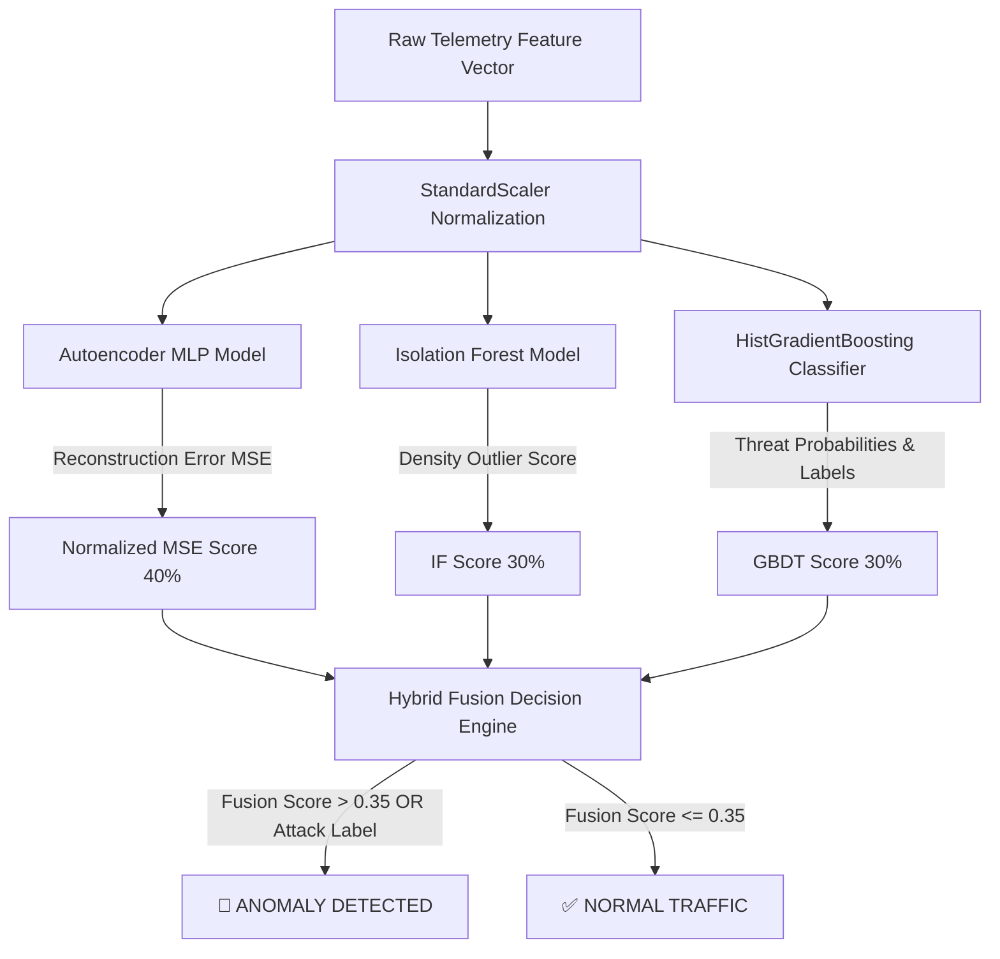

# 🛡️ ANTIGRAVITY SHIELD XDR & Hybrid Ensemble AI Platform

[](https://www.python.org/)
[](https://flask.palletsprojects.com/)
[](#-hybrid-ensemble-ai-engine-v30)
[](#-soar-automated-response-engine)
[](#-wazuh-siem--agent-security-monitor)
[](#-owasp-aivss-v4-calculator)
[](#-bilingual-support-th--en)

**ANTIGRAVITY SHIELD XDR** เป็นแพลตฟอร์ม **Extended Detection and Response (XDR)** และระบบรักษาความปลอดภัยเครือข่ายอัจฉริยะ ทำงานด้วยเอนจิน **Hybrid Ensemble Machine Learning & Deep Learning (v3.0)** ร่วมกับการวิเคราะห์ความปลอดภัยตามกฎกติกา **Wazuh SIEM** และคำนวณความรุนแรงของช่องโหว่ AI ตามมาตรฐาน **OWASP AIVSS v4** ระบบนี้ถูกออกแบบมาเพื่อตรวจจับ ป้องกัน และรับมือกับภัยคุกคามไซเบอร์ข้าม Vector แบบ Real-Time ครอบคลุมทั้ง **Network, Endpoint และ Identity** พร้อมระบบ **SOAR (Security Orchestration, Automation, and Response)** อัตโนมัติ

---

## 📑 สารบัญ (Table of Contents)
- [✨ คุณสมบัติหลัก (Key Features)](#-คุณสมบัติหลัก-key-features)
- [🏗️ โครงสร้างสถาปัตยกรรมระบบ (System Architecture)](#️-โครงสร้างสถาปัตยกรรมระบบ-system-architecture)
- [🧠 Hybrid Ensemble AI Engine (v3.0)](#-hybrid-ensemble-ai-engine-v30)
- [🦊 Wazuh SIEM & Agent Security Monitor](#-wazuh-siem--agent-security-monitor)
- [🧮 OWASP AIVSS v4 Calculator](#-owasp-aivss-v4-calculator)
- :zap: [ระบบ SOAR (Automated Response & Playbooks)](#-ระบบ-soar-automated-response--playbooks)
- [🚀 ขั้นตอนการติดตั้งและการใช้งาน (Installation & Quick Start)](#-ขั้นตอนการติดตั้งและการใช้งาน-installation--quick-start)
- [💻 การใช้งานผ่าน Command Line Interface (CLI)](#-การใช้งานผ่าน-command-line-interface-cli)
- [🔌 REST API Reference](#-rest-api-reference)
- [🛠️ การแก้ไขปัญหา (Troubleshooting & FAQs)](#️-การแก้ไขปัญหา-troubleshooting--faqs)

---

## ✨ คุณสมบัติหลัก (Key Features)

* **🌐 Multi-Vector Telemetry Correlation**: รวบรวมข้อมูลและวิเคราะห์ความเชื่อมโยงภัยคุกคามข้ามมิติทั้ง Network Flows, Endpoint Process Execution (`psutil`, `nc.exe`, `mimikatz.exe`) และ Identity Authentication Logs
* **🤖 Hybrid Ensemble AI Detection**: รวมพลัง 3 โมเดล AI (Autoencoder Deep Learning + Isolation Forest + HistGradientBoosting Classifier) เพื่อวิเคราะห์ความผิดปกติของ Network Flow โดยลดโอกาสแจ้งเตือนผิดพลาด (False Positives) ลงอย่างมีประสิทธิภาพ
* **🦊 Simulated Wazuh SIEM & XML Editor**: ระบบจำลองการเฝ้าระวังความปลอดภัยของโฮสต์ (Wazuh Agent Keepalives, File Integrity Monitoring และ Vulnerability Detector) พร้อมหน้ารันคิวประเมินผลผ่านไฟล์กฎกติกา XML ที่สามารถแก้ไขและบันทึกสดได้บนหน้าเว็บ
* **🧮 OWASP AIVSS v4 Severity Scoring**: โมเดลคำนวณคะแนนความรุนแรงของช่องโหว่บนระบบปัญญาประดิษฐ์ (AI Vulnerability Severity Score) ตามสเปกทางการของ OWASP ครอบคลุมความปลอดภัยของ Classifier Security, Generative Vulnerabilities และ Model Complexity
* **⚡ Active SOAR Playbooks**: ระบบตอบสนองอัตโนมัติ เช่น กักกันโฮสต์ (`Isolate Host`), บล็อกไอพีบน Windows Firewall (`netsh advfirewall`), และสั่งยุติโปรเซสอันตราย (`taskkill /F /PID`)
* **🛡️ Live OS Execution Toggle**: สลับโหมดการทำงานระหว่าง **Simulation (Dry-Run)** และ **Live OS Execution (สั่งการใช้งานระบบปฏิบัติการจริง)** ได้จากแดชบอร์ด
* **📊 Glassmorphic Dark-Mode UI**: หน้าจอเว็บควบคุมความปลอดภัยระดับพรีเมียม สลับภาษาได้ทันที (ไทย/อังกฤษ) อัปเดตข้อมูลแบบสดใหม่ และแสดงผลการวิเคราะห์สาเหตุเชิงลึก (Root Cause Analysis - RCA)

---

## 🏗️ โครงสร้างสถาปัตยกรรมระบบ (System Architecture)

ระบบประกอบไปด้วยโครงสร้างการทำงานแบบโมดูลาร์ที่ประสานพลังกันดังนี้:

```
Telemetry Sniffer / Host Metrics
          │
          ▼
 ┌─────────────────────────────────────────────────────────┐
 │               traffic_monitor.py                        │
 │  - Live Packet Sniffer (Scapy / Raw Sockets)             │
 │  - Feature Extraction (Packets, Bytes, Ports, Ratios)   │
 │  - HybridEnsembleDetector (AI Model Engine v3.0)       │
 └──────────────────────────┬──────────────────────────────┘
                            │ Network Flows / Anomaly Score
                            ▼
 ┌─────────────────────────────────────────────────────────┐
 │                  wazuh_manager.py                       │
 │  - Reads and parses wazuh_rules.xml                     │
 │  - Simulated Endpoint Agents (Keepalive, FIM, Vuln)    │
 │  - Evaluates telemetry against XML rules & raises Alerts│
 └──────────────────────────┬──────────────────────────────┘
                            │ Wazuh Security Alerts
                            ▼
 ┌─────────────────────────────────────────────────────────┐
 │                  xdr_engine.py                          │
 │  - Multi-Vector Correlator (Net + Endpoint + Identity)   │
 │  - Security Threat Matrix Scoring (0-100 Rating)         │
 │  - SOAR Automated Playbook Execution                     │
 │  - OS Firewall & Process Enforcement Blockers            │
 └──────────────────────────┬──────────────────────────────┘
                            │ Web API JSON State
                            ▼
 ┌─────────────────────────────────────────────────────────┐
 │                      app.py                             │
 │  - Flask Web Server (http://127.0.0.1:5000)             │
 │  - Background Worker Loop (Executes Sniffer / Rules)    │
 │  - OWASP AIVSS v4 Scoring API Server                    │
 └──────────────────────────┬──────────────────────────────┘
                            │ Render HTML / UI Data
                            ▼
 ┌─────────────────────────────────────────────────────────┐
 │               templates/index.html                      │
 │  - Interactive glassmorphism Dark UI (TH/EN Support)    │
 │  - Live Security Alerts Console & Wazuh SIEM Tabs       │
 │  - Custom Live XML Editor & AIVSS Scoring Panel         │
 └─────────────────────────────────────────────────────────┘
```

---

## 🧠 Hybrid Ensemble AI Engine (v3.0)

เอนจินการตรวจจับความผิดปกติบนเครือข่ายใช้สถาปัตยกรรม **Weighted Hybrid Ensemble** เพื่อรวมความสามารถในการตรวจจับภัยคุกคามทราฟฟิกเครือข่ายดังแผนผัง:



* **Autoencoder (Unsupervised Deep Learning)**: เทรนเฉพาะทราฟฟิกปกติ เพื่อตรวจวัดความคลาดเคลื่อนในการสร้างข้อมูลขึ้นมาใหม่ (Reconstruction Error) ดักจับ **Zero-Day Attacks** ที่ผิดแปลกไปจาก Baseline เดิม
* **Isolation Forest (Unsupervised Machine Learning)**: ตรวจสอบความหนาแน่นและแยกตัวอย่าง (Outliers) ในมิติข้อมูลเครือข่าย
* **HistGradientBoosting Classifier (Supervised Machine Learning)**: จำแนกประเภทการโจมตีโดยเฉพาะ เจาะจงออกมาเป็น `PORT_SCAN`, `DDOS`, หรือ `DATA_EXFILTRATION` พร้อมเปอร์เซ็นต์ความน่าจะเป็น (Confidence Level)

---

## 🦊 Wazuh SIEM & Agent Security Monitor

โปรแกรม [wazuh_manager.py](file:///c:/Network/wazuh_manager.py) จะทำการจำลองระบบและโฮสต์ที่เป็นเอเจนต์ และรับข้อมูล Telemetry มาตรวจสอบกับกฎที่ถูกโหลดขึ้นมาจากไฟล์ [wazuh_rules.xml](file:///c:/Network/wazuh_rules.xml):

### โครงสร้างของกฎ Wazuh XML Rules
กฎต่าง ๆ ถูกจัดประเภทเป็นหมวดหมู่ (เช่น `endpoint`, `network`, `identity`) และมีระดับความรุนแรง (Level 1 ถึง 15) ซึ่งสามารถปรับเปลี่ยนค่าทางสถิติหรือชื่อสิทธิ์ในการตรวจจับได้:

```xml
<rules>
  <group name="endpoint">
    <rule id="100002" level="12">
      <field name="process_name">mimikatz.exe</field>
      <description>Critical threat: credential dumping tool Mimikatz detected</description>
    </rule>
    <rule id="100003" level="9">
      <field name="cpu" type="float" operator="gt">85.0</field>
      <description>High CPU usage anomaly detected on agent</description>
    </rule>
  </group>
</rules>
```

### การตอบโต้ระดับ Agent (Active Response)
ผู้ใช้สามารถสั่งคำสั่งเฉพาะของ Wazuh Agent ได้แบบรายโฮสต์ผ่านหน้าเว็บ เช่น **Restart Agent** หรือรัน **File Integrity Monitoring (FIM)** สแกนหาการเปลี่ยนแปลงของระบบไฟล์ระบบ

---

## 🧮 OWASP AIVSS v4 Calculator

คุณลักษณะการประเมินความปลอดภัยเฉพาะของปัญญาประดิษฐ์ ดำเนินการคำนวณผ่านโมดูล [aivss_engine.py](file:///c:/Network/aivss_engine.py) ซึ่งเป็นคะแนนความรุนแรงของภัยคุกคามบน AI (OWASP AI Vulnerability Severity Score v4):

* **Base Metrics**: คำนวณขอบเขตการเข้าถึงของผู้โจมตี (Attack Vector), ความซับซ้อน (Attack Complexity), สิทธิ์การเข้าถึง (Privileges Required), และสวิตช์ขอบเขตระบบ (Scope)
* **AI-Specific Metrics**: คำนวณความเสี่ยงของแบบจำลอง เช่น อคติและการเรียนรู้ที่ไม่ปลอดภัย (Generative Vulnerabilities - GV) ความเสี่ยงจากการถูกรบกวนข้อมูลและเลี่ยงการจำแนกประเภท (Classifier Security - CS) และความซับซ้อนของโครงข่ายระบบ AI (Model Complexity - MC)
* **Impact, Temporal, Environmental, Mitigation Metrics**: วิเคราะห์สภาพแวดล้อมใช้งานจริงเพื่อชั่งน้ำหนักผลกระทบและอัตราความรุนแรงสุทธิ โดยให้คะแนนอยู่ในช่วง `0.0 - 10.0` พร้อมการจำแนกสถานะความอันตราย (`LOW`, `MEDIUM`, `HIGH`, `CRITICAL`)

---

## :zap: ระบบ SOAR (Automated Response & Playbooks)

เอนจิน SOAR ([xdr_engine.py](file:///c:/Network/xdr_engine.py)) ตรวจวัดความรุนแรงและรวบรวมข้อมูลภัยคุกคามเพื่อสั่งแผนการโต้ตอบ (Playbooks) ออกมาใช้งานอัตโนมัติ:

| Threat Event | Severity | SOAR Action | Live OS Command (เมื่อเปิด Live OS Mode) |
| :--- | :---: | :--- | :--- |
| **PORT_SCAN** | HIGH | `BLOCK_IP` + `ISOLATE_HOST` | `netsh advfirewall firewall add rule name="XDR_Block_IP" dir=in action=block remoteip=<IP>` |
| **DDOS ATTACK** | CRITICAL | `BLOCK_IP` + `ISOLATE_HOST` | สั่งการปิดกั้นและบล็อกอินเทอร์เฟซ IP ของระบบปลายทางทันที |
| **MALICIOUS EXECUTION** | CRITICAL | `KILL_PROCESS` + `ISOLATE_HOST` | `taskkill /F /PID <PID>` (เช่น สั่งปิด `nc.exe` / `mimikatz.exe` ที่เป็นอันตราย) |
| **BRUTE_FORCE / IDENTITY**| MEDIUM | `REVOKE_SESSION` | ยกเลิก Session การเชื่อมต่อ และจำกัดสิทธิ์ผู้ใช้ชั่วคราว |

---

## 🚀 ขั้นตอนการติดตั้งและการใช้งาน (Installation & Quick Start)

### 1. ความต้องการของระบบ (Prerequisites)
* **ระบบปฏิบัติการ**: Windows 10/11 (แนะนำสำหรับการทดสอบคำสั่งระบบจริงผ่าน Live OS Mode) หรือ Linux/macOS
* **เวอร์ชัน Python**: Python 3.10 ขึ้นไป
* **Npcap (สำหรับ Windows เท่านั้น)**: หากคุณต้องการดักจับแพ็กเก็ตการเชื่อมต่อจริงในคอมพิวเตอร์ของคุณ ให้ติดตั้ง [Npcap](https://npcap.com/) ก่อนการใช้งาน

### 2. ขั้นตอนการติดตั้ง
เปิด Terminal หรือ PowerShell ของคุณแล้วดำเนินการดังต่อไปนี้:

```powershell
# 1. ย้ายตำแหน่งเข้าสู่โฟลเดอร์โปรเจกต์
cd c:\Network

# 2. ทำการเปิดใช้งาน Virtual Environment
.\venv\Scripts\activate

# 3. ติดตั้ง Dependencies และ Library ทั้งหมด
pip install -r requirements.txt
```

---

## 💻 การใช้งานผ่าน Command Line Interface (CLI)

คุณสามารถควบคุมการทำงานของระบบตรวจจับภัยคุกคามได้หลากหลายโหมดผ่านคอมมานด์ไลน์:

### 1. การรันเซิร์ฟเวอร์หลัก (Web Dashboard App)
รันเซิร์ฟเวอร์ Flask เพื่อเปิดเว็บควบคุมและหน้าจอแดชบอร์ด:
```powershell
python app.py
```
เปิดใช้งานผ่านเว็บเบราว์เซอร์ของคุณที่ลิงก์: **`http://127.0.0.1:5000`**

### 2. รันระบบตรวจจับพฤติกรรมแปลกปลอมจริง (Live Sniffer Mode)
ทำการรันโปรแกรมตรวจสอบและวิเคราะห์การเชื่อมต่อผ่านการ์ดแลนของคุณจริง ๆ:
```powershell
python traffic_monitor.py --mode detect
```
*(จำเป็นต้องรันคอมมานด์ไลน์ด้วยสิทธิ์ผู้ดูแลระบบ (Run as Administrator))*

### 3. รันโหมดจำลองทราฟฟิกโจมตีเครือข่าย (Simulation Mode)
สร้างทราฟฟิกจำลองการทำงานปกติและการสแกนพอร์ต/DDoS ขึ้นมาให้ระบบประเมินผล:
```powershell
python traffic_monitor.py --mode simulate
```

### 4. รันการเทรน AI Baseline ด้วยตนเอง (Model Retraining CLI)
รวบรวมทราฟฟิกในปัจจุบันมาวิเคราะห์และบันทึกเป็นโมเดลสำหรับประเมิน Baseline ตัวใหม่:
```powershell
python traffic_monitor.py --mode train
```

---

## 🔌 REST API Reference

เซิร์ฟเวอร์ระบบให้บริการ API ครอบคลุมทุกความสามารถของการทำงานเพื่อรองรับการต่อยอมหรือเชื่อมระบบภายนอก:

### 1. เอนจิน XDR
* **`GET /api/xdr/data`**: ดึงข้อมูลสถิติของ XDR, telemetry ล่าสุด, รายการกักกันโฮสต์, บล็อกไอพี และประวัติการตอบโต้ภัยคุกคาม
* **`POST /api/xdr/response`**: ส่งคำสั่งตอบโต้ความปลอดภัยแบบแมนนวล:
  * Body: `{"action": "isolate_host", "target": "192.168.1.24"}`
  * รองรับการทำงาน: `isolate_host`, `release_host`, `block_ip`, `unblock_ip`, `kill_process`, `whitelist_ip`, `unwhitelist_ip`
* **`POST /api/xdr/config`**: เปิด/ปิดความสามารถของระบบควบคุม:
  * Body: `{"soar_enabled": true, "real_execution_enabled": false}`
* **`POST /api/xdr/clear_incidents`**: ล้างข้อมูลและรีเซ็ตคิวเหตุการณ์การกักกันโฮสต์ทั้งหมด

### 2. ระบบคำนวณคะแนนภัยคุกคาม AI (OWASP AIVSS v4)
* **`POST /api/aivss/calculate`**: รับพารามิเตอร์เพื่อประเมินความปลอดภัย:
  * Body: JSON ข้อมูลตัวเลือกของ Metrics (เช่น `industry_id`, `av`, `ac`, `ai_metrics`)
  * Response: ส่งกลับค่าคะแนนคำนวณ AIVSS score (`0.0 - 10.0`), ระดับความรุนแรง (`LOW`, `MEDIUM`, `HIGH`, `CRITICAL`) และคะแนนจำแนกตามประเภทของโมเดล

### 3. ระบบจำลอง Wazuh SIEM
* **`GET /api/wazuh/status`**: ดึงข้อมูล Keepalive ของ Agent ทุกตัว, ประวัติการแจ้งเตือนความปลอดภัย, ประวัติ Active Response และข้อความ XML กฎการเฝ้าระวัง
* **`POST /api/wazuh/action`**: ส่งการตอบโต้การป้องกันไปยัง Agent:
  * Body: `{"agent_id": "002", "action": "fim_scan"}`
  * รองรับการทำงาน: `fim_scan`, `restart_agent`
* **`POST /api/wazuh/rules/save`**: บันทึกและรีเซ็ตกฎความปลอดภัย XML ใหม่เข้าไปในเอนจินของ Wazuh
  * Body: `{"rules_xml": "<rules>...</rules>"}`

---

## 🛠️ การแก้ไขปัญหา (Troubleshooting & FAQs)

#### Q1: ระบบมีการแจ้งเตือนไอพีปลอดภัยในเครือข่าย หรือไอพีของเครื่องตนเองบ่อยครั้ง (False Alarm)?
* **คำอธิบาย**: การใช้งานอินเทอร์เน็ตที่สูงขึ้นชั่วคราวอาจหลุดขอบ baseline เดิมที่โมเดลเคยเรียนรู้ คุณสามารถแก้ไขโดย:
  1. กดปุ่ม **"Whitelist"** ด้านข้างข้อมูลไอพีในรายการ เพื่อลงทะเบียนเป็นเครื่องยกเว้นการโจมตีแบบคลิกเดียว
  2. กดปุ่ม **"เทรนโมเดล AI ใหม่" (Train AI Baseline)** บนเมนูด้านซ้าย เพื่อให้ AI ปรับจูนเรียนรู้น้ำหนักพฤติกรรมปัจจุบันเป็น Baseline ค่าปกติใหม่

#### Q2: ปุ่ม "รับคำสั่งจริงบนระบบ OS" (Live OS Execution) มีการทำงานอย่างไร?
* **คำอธิบาย**: เพื่อความปลอดภัย ในการรันเริ่มต้นระบบจะกำหนดเป็น **OFF** (Simulation Mode) เอนจิน SOAR จะสร้างเพียงข้อความและบันทึกประวัติการยับยั้งภัยคุกคาม หากปรับเป็น **ON** ระบบจะใช้คำสั่งของ Windows (`taskkill`, `netsh advfirewall`) เพื่อจัดการบล็อกการเชื่อมต่อและยุติโปรเซสจริง ๆ

#### Q3: ตารางแสดงเหตุการณ์มีจำนวนมากเกินไปจนหน้าเว็บไม่พอดีหน้าจอ?
* **คำอธิบาย**: หน้าเว็บถูกออกแบบตาราง XDR Incidents และ Wazuh Alerts ให้มีแถบเลื่อนแนวตั้ง (`scrollable vertical panel`) ที่ขนาด `360px` พร้อมการล็อกตำแหน่งหัวตาราง (Sticky Headers) ป้องกันตารางล้นจอเรียบร้อยแล้ว หรือหากต้องการล้างเหตุการณ์เดิมทั้งหมดเพื่อเริ่มต้นใหม่ สามารถกดปุ่ม **"ล้างรายการเหตุการณ์" (Clear All)** ได้ทันที

---

© 2026 **ANTIGRAVITY SHIELD XDR PLATFORM** — Developed with Advanced Agentic AI Security Engineering.
